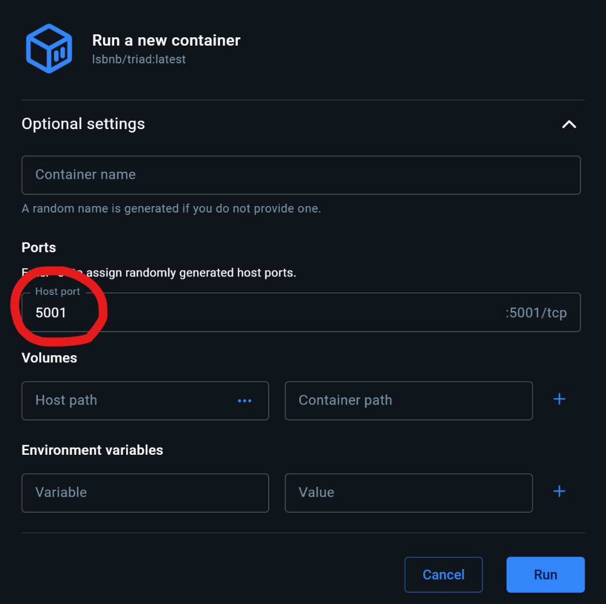

# TRIAD Framework — User Guide & API Documentation

**TRIAD: T-Cell Epitope Ranking, Immunogenicity, and Allele Distribution Framework**  
*Integrated High-Throughput MHC Class I Antigen Presentation, Physicochemical T-Cell Immunogenicity Scoring, and Global Population Coverage Architecture.*  
*Developed by Laboratory of Structural Bioinformatics and Network Biology (LSBNB), Institute of Information Science, Academia Sinica, Taiwan.*

---

## Table of Contents
1. [Overview & Architecture](#overview--architecture)
2. [NetMHCpan Setup & Academic Licensing Guide](#netmhcpan-setup--academic-licensing-guide)
3. [Input Formats & Specifications](#input-formats--specifications)
4. [HLA Allele Selection & Population Presets](#hla-allele-selection--population-presets)
5. [Output Metrics & Interpretation Guide](#output-metrics--interpretation-guide)
6. [Batch Multi-File Parallel Engine](#batch-multi-file-parallel-engine)
7. [REST API & Command-Line Automation](#rest-api--command-line-automation)
8. [Hardware Acceleration & In-Memory RAM Disk](#hardware-acceleration--in-memory-ram-disk)
9. [Frequently Asked Questions (FAQ)](#frequently-asked-questions-faq)
10. [Citations & Scientific References](#citations--scientific-references)

---

## 1. Overview & Architecture

TRIAD integrates three complementary computational dimensions to rank and prioritize CD8+ cytotoxic T-cell epitopes for vaccine design, immunotherapy, and neoantigen discovery:

1. **MHC-I Antigen Presentation Model** (Reynisson et al., 2020):
   Predicts presentation probability (`%Rank EL`) and quantitative binding affinity (`Affinity_nM` / IC50) using artificial neural networks trained on over 1 million mass spectrometry eluted ligands (MS-EL) and experimental binding affinity (BA) measurements.
2. **Physicochemical T-Cell Immunogenicity Model** (Calis et al., 2013):
   Scores the intrinsic capability of MHC-bound peptides to trigger TCR (T-cell receptor) activation based on position-weighted amino acid physicochemical properties (aromaticity, large hydrophobicity, side-chain bulkiness at TCR-facing positions 4, 5, 6, 7, and 8).
3. **Cumulative Population Coverage Estimation**:
   Computes non-redundant human population coverage (%) across target regions (Taiwan, East Asia, Europe, World) derived from high-quality allele frequency databases (AFND, Tzu Chi Marrow Repository, and 1000 Genomes).
4. **Composite Priority Score (CPS)**:
   A multi-objective candidate prioritization function balancing presentation likelihood, T-cell immunogenicity, and allele breadth.

---

## 2. NetMHCpan Setup & Academic Licensing Guide

### Academic License Notice
`netMHCpan-4.2` is academic-licensed software copyrighted by DTU Health Tech (Technical University of Denmark). Its license terms strictly prohibit redistribution of the binary and model weights to third parties (`"not give the program to third parties"`).

For legal compliance, the official Docker container (`lsbnb/triad`) ships as a clean application shell **without** the pre-bundled DTU binary. Each user must obtain their own copy under their own license acceptance.

### Step 1: Request & Download Package from DTU
1. Visit the [official DTU Health Tech Download Portal](https://services.healthtech.dtu.dk/services/NetMHCpan-4.2/).
2. Submit your academic institution email, accept the academic license terms, and download the Linux tarball (named `netMHCpan-4.2.Linux.tar.gz`).

### Step 2: Configure the Container (Choose Option A, Option B, or Option C)

#### Option A: Docker Volume Mount (Recommended for Servers / CLI)
Extract the downloaded package on your host machine and mount it directly into `/opt/netMHCpan-4.2`:
```bash
# 1. Extract package on host
tar -xzvf netMHCpan-4.2.Linux.tar.gz

# 2. Run TRIAD container with volume mount
docker run -d --name triad_app \
  -p 5001:5001 \
  -v /dev/shm:/dev/shm \
  -v "$(pwd)/netMHCpan-4.2:/opt/netMHCpan-4.2" \
  lsbnb/triad:latest
```

#### Option B: Docker Desktop GUI Setup (Windows / Mac Desktop Users)
> ⚠️ **Important Port Mapping Notice:**  
> When running the container via **Docker Desktop GUI**, expand **Optional Settings** before clicking *Run* and specify:
> - **Host Port**: `5001`
> - **Container Port**: `5001`
> 
> Without configuring `5001:5001` in Optional Settings, Docker Desktop will not forward web traffic and `http://localhost:5001` will not load.



#### Option C: Built-in Web Setup Wizard (No Terminal Required)
If you prefer not to touch the host terminal:
1. Start the container mapping port `5001:5001`:
   ```bash
   docker run -d --name triad_app -p 5001:5001 lsbnb/triad:latest
   ```
2. Open your web browser to `http://localhost:5001/setup`.
3. Select your downloaded `netMHCpan-4.2.Linux.tar.gz` package.
4. Check the academic license compliance confirmation checkbox and click **Upload & Install**.
5. The platform will automatically unpack, configure execution permissions, verify binary integrity, and redirect you directly to the prediction pipeline.

---

## 3. Input Formats & Specifications

TRIAD supports two primary input modes:

### Mode A: Peptide List Mode (`.pep`, `.txt`, or direct text)
- **Format**: Plain text with one peptide sequence per line.
- **Length**: **8 to 14 amino acids** (canonical MHC Class I binding length; 9-mer and 10-mer recommended).
- **Alphabet**: Standard 20 single-letter IUPAC natural amino acid codes (`A`, `C`, `D`, `E`, `F`, `G`, `H`, `I`, `K`, `L`, `M`, `N`, `P`, `Q`, `R`, `S`, `T`, `V`, `W`, `Y`).
- **Comments**: Lines starting with `#` or empty lines are automatically skipped.

**Example Peptide Input:**
```text
AAAWYLWEV
AEFGPWQTV
YLLPAIVHI
FLPSDFFPSV
GILGFVFTL
```

### Mode B: FASTA Protein Sequence Mode (`.fasta`, `.fsa`, `.fa`)
- **Format**: Standard FASTA format with header line beginning with `>` followed by the full-length or partial protein sequence.
- **Sliding Window Ingestion**: The system digests the input sequence into all overlapping k-mers based on specified peptide lengths (e.g., `8,9,10`).
- **Multi-FASTA**: You may submit multiple protein records sequentially.

**Example FASTA Input:**
```text
>sp|P0DTC2|SPIKE_SARS2 Spike protein fragment
MFVFLVLLPLVSSQCVNLTTRTQLPPAYTNSFTRGVYYPDKVFRSSVLHSTQDLFLPFFSNVTWFHAIH
VSGTNGTKRFDNPVLPFNDGVYFASTEKSNIIRGWIFGTTLDSKTQSLLIVNNATNVVIKVCEFQFCND
PFLGVYYHKNNKSWMESEFRVYSSANNCTFEYVSQPFLMDLEGKQGNFKNLREFVFKNIDGYFKIYSKH
```

---

## 4. HLA Allele Selection & Population Presets

### Allele Nomenclature
Alleles must adhere to standard IPD-IMGT/HLA nomenclature:
- Class I canonical format: `HLA-A*02:01`, `HLA-B*07:02`, `HLA-C*07:02`
- Legacy / compact format automatically normalized: `HLA-A02:01` or `A*02:01` -> `HLA-A*02:01`

### Built-in Regional Presets
Click any of the preset chips on the UI to load verified high-frequency allele combinations:
- **🇹🇼 Taiwan Common**: High-frequency Han Taiwanese HLA markers (e.g., `HLA-A*11:01` [~45% frequency], `A*24:02`, `A*02:07`, `A*33:03`, `B*40:01`, `B*58:01`, `C*07:02`).
- **🌏 East Asian**: Predominant alleles in East Asian cohorts (`HLA-A*24:02`, `A*02:01`, `A*11:01`, `B*46:01`, `B*40:01`, `C*01:02`).
- **🌍 European**: Western European reference alleles (`HLA-A*02:01`, `A*01:01`, `A*03:01`, `B*07:02`, `B*08:01`, `C*07:01`).
- **🌐 World Reference Set**: 12 global representative alleles providing >90% worldwide population coverage.

### Custom HLA File Upload
Upload custom HLA lists (`.txt`, `.csv`, `.tsv`) with one allele per line or comma/tab-separated.

---

## 5. Output Metrics & Interpretation Guide

| Column Name | Metric | Interpretation & Decision Thresholds |
| :--- | :--- | :--- |
| **`Score_EL`** | Eluted Ligand Presentation Score | Range `[0.0, 1.0]`. Raw neural network probability that the peptide is naturally presented on the cell surface. |
| **`%Rank_EL`** | Presentation Percentile Rank | **Key Metric for Epitope Selection**.<br>• **$\le 0.5\%$**: **Strong Binder (SB)** — Highest confidence of natural presentation.<br>• **$0.5\% < \text{Rank} \le 2.0\%$**: **Weak Binder (WB)** — Potential presentation.<br>• **$> 2.0\%$**: Non-binder. |
| **`Affinity_nM`** | Predicted Binding Affinity (IC50) | Estimated half-maximal inhibitory concentration in nanomolar (nM):<br>• **$< 50\text{ nM}$**: High affinity.<br>• **$50 - 500\text{ nM}$**: Moderate affinity (standard immunogenicity cutoff).<br>• **$> 500\text{ nM}$**: Low/no affinity. |
| **`Immunogenicity_Score`** | Physicochemical T-Cell Score | Calis et al. (2013) log-odds activation score:<br>• **$> 0.0$**: Positive T-cell receptor recognition propensity.<br>• **$< 0.0$**: Low immunogenicity likelihood (often due to non-bulky or hydrophilic residues at TCR-facing positions). |
| **`BindLevel`** | Binder Classification | `SB` (Strong Binder), `WB` (Weak Binder), or empty (Non-binder). |
| **`Composite_Score`** | Multi-Factor Composed Index | Range `[0.0000, 1.0000]`. Golden candidate score synthesizing 4 dimensions:<br>• **40% Presentation** ($S_{\text{pres}}$ via %Rank_EL)<br>• **25% Binding Affinity** ($S_{\text{aff}}$ via IC50)<br>• **25% TCR Immunogenicity** ($S_{\text{imm}}$ via Calis model)<br>• **10% HLA Breadth** ($S_{\text{breadth}}$ cross-allele promiscuity). Higher is better. |
| **`Tier`** | Decision Priority Tier | • **`Tier 1`**: %Rank_EL $\le 0.5\%$ + Immunogenicity $>0$ + Composite $\ge 0.65$ (Top priority for experimental validation).<br>• **`Tier 2`**: %Rank_EL $\le 2.0\%$ + Composite $\ge 0.45$ (Secondary candidates).<br>• **`Tier 3`**: Weak/non-binders or lacking TCR features (Low priority/controls). |

---

## 6. Batch Multi-File Parallel Engine

For large-scale processing of proteomes, viral variants, or patient cohort libraries:
1. Navigate to the **📦 Batch Engine** tab.
2. Drag and drop multiple `.fasta`, `.fsa`, `.pep`, or `.txt` files simultaneously into the drop zone.
3. Select desired HLA alleles or click a regional preset.
4. Click **▶ Run Batch Processing Pipeline**.
5. The scheduler distributes sequence chunks evenly across up to 40 CPU cores in parallel, utilizing RAM disk (`/dev/shm`) for zero-disk-latency temporary I/O.
6. Upon completion, click **⬇ Download Batch CSV** to export consolidated multi-file reports.

---

## 7. REST API & Command-Line Automation

TRIAD exposes a standard REST API on port `5001`.

### Health & Hardware Status
```bash
curl -s http://localhost:5001/api/system_resources | jq .
```

### Submit Prediction Job
```bash
curl -s -X POST http://localhost:5001/api/predict \
  -H "Content-Type: application/json" \
  -d '{
    "mode": "peptide",
    "input": "AAAWYLWEV\nAEFGPWQTV\nYLLPAIVHI\nGILGFVFTL",
    "alleles": ["HLA-A*02:01", "HLA-B*07:02"],
    "lengths": [9],
    "include_ba": true
  }'
```
**Response:**
```json
{
  "job_id": "c4d7e821",
  "status": "running"
}
```

### Poll Job Status & Retrieve Results
```bash
curl -s http://localhost:5001/api/job/c4d7e821 | jq .
```

### Download CSV / Excel Report
```bash
# Download CSV
curl -O http://localhost:5001/api/download/c4d7e821/csv

# Download Excel Spreadsheet
curl -O http://localhost:5001/api/download/c4d7e821/xlsx
```

### Orthogonal Matrix Cross-Validation (SMM / Comblib)
```bash
curl -s -X POST http://localhost:5001/api/predict_oss \
  -H "Content-Type: application/json" \
  -d '{
    "peptides": ["GILGFVFTL", "YLLPAIVHI"],
    "allele": "HLA-A*02:01",
    "methods": ["smm", "smmpmbec", "comblib"]
  }' | jq .
```

---

## 8. Hardware Acceleration & In-Memory RAM Disk

TRIAD automatically profiles host resources at startup:
- **Parallel Chunking**: Calculates optimal CPU partition workers based on sequence length and CPU core count.
- **RAM Disk Accelerator (`/dev/shm`)**:
  All intermediate sequences, temporary neural network input pipes, and chunk outputs are written directly to memory (`/dev/shm/netmhc_tmp`). This avoids physical disk wear, eliminates file lock contention, and provides a 3–5x acceleration over standard disk storage.
- **Automatic Cleanup**: Temporary directories are rigorously unlinked and freed after every worker execution.

---

## 9. Frequently Asked Questions (FAQ)

#### Q1: Why are my sequences rejected with "invalid length"?
**Answer:** MHC Class I peptide binding grooves are closed at both the N- and C-termini, restricting canonical binding to **8–14 amino acids**. If you have a full protein sequence, ensure you switch to **FASTA Format** so the engine can automatically digest the protein into 8–14 aa k-mers.

#### Q2: What is the difference between `%Rank EL` and `Affinity (IC50)`?
**Answer:** `%Rank EL` models natural antigen presentation (including intracellular processing, TAP transport, and stable cell-surface presentation). `Affinity_nM` measures pure in vitro biochemical binding stability. Peptides with low `%Rank EL` ($\le 0.5\%$) have the highest likelihood of in vivo immunological relevance.

#### Q3: Can I run custom HLA combinations from patient genotyping?
**Answer:** Yes. Paste or search individual alleles in the search box, or upload a `.txt` file containing your patient's 4-digit HLA alleles under the Regional Presets section.

#### Q4: What if I need to reconfigure or verify my NetMHCpan installation?
**Answer:** Visit `http://localhost:5001/setup` at any time to verify installation status, view current paths, or upload an updated package.

---

## 10. Citations & Scientific References

If you use TRIAD in published scientific research, please cite:
1. **MHC Presentation Model**:  
   Reynisson B, Alvarez B, Paul S, Peters B, Nielsen M.  
   *NetMHCpan-4.1 and NetMHCIIpan-4.0: improved predictions of MHC antigen presentation by concurrent motif deconvolution and integration of MS eluted ligand data.*  
   **Nucleic Acids Res.** 2020;48(W1):W449-W454. [doi:10.1093/nar/gkaa379](https://doi.org/10.1093/nar/gkaa379)
2. **T-Cell Immunogenicity Model**:  
   Calis JJ, Maybeno M, Greenbaum JA, et al.  
   *Properties of MHC Class I Presented Peptides That Inspire Immunogenicity.*  
   **PLoS Comput Biol.** 2013;9(10):e1003266. [doi:10.1371/journal.pcbi.1003266](https://doi.org/10.1371/journal.pcbi.1003266)
3. **Population Coverage & Allele Frequencies**:  
   Gonzalez-Galarza FF, et al.  
   *Allele frequency net database (AFND) 2020 update: gold-standard data classification, open access genotype data and new query tools.*  
   **Nucleic Acids Res.** 2020;48(D1):D783-D788. [doi:10.1093/nar/gkz1029](https://doi.org/10.1093/nar/gkz1029)
4. **Platform & Computational Architecture**:  
   *Laboratory of Structural Bioinformatics and Network Biology (LSBNB), Institute of Information Science, Academia Sinica, Taiwan.*
