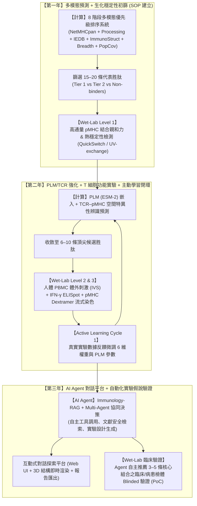

# 三年期研究與發展計畫書

## 計畫名稱：基於多模態計算與次世代 AI Agent 之整合型 T 細胞抗原表位優先級排序與乾濕閉環探索平台
**(Multimodal T-cell Epitope Prioritization and Autonomous Immunology AI Agent Platform with Dry-to-Wet Active Learning)**

---

## 摘要 (Executive Summary)

精準免疫治療（如個人化癌症新抗原疫苗、TCR-T 細胞療法）與次世代抗病毒疫苗開發的核心在於**高效且準確地篩選出最具真實生物活性的 T 細胞抗原表位（T-cell Epitopes）**。傳統純計算方法往往過度依賴單一維度的 MHC 結合親和力（MHC Binding Affinity），忽略了抗原處理運輸（Antigen Processing）、3D pMHC 結構空間構型、T 細胞受體（TCR）辨識潛力以及族群遺傳覆蓋率等關鍵因素；更關鍵的是，**缺乏濕實驗（Wet-lab）系統性驗證與數據反饋閉環，導致預測模型存在較高偽陽性且無法持續迭代進化**。

本計畫立足於團隊已完成之**多模態 8 階段 T-cell Epitope Prioritization 計算管線**，規劃為期三年的深耕與跨越計畫，核心特色在於**「乾濕整合（Dry-to-Wet）漏斗型主動學習閉環」**與**「次世代 AI Agent 智慧化對話探索」**：
1. **第一年**：完善多模態抗原呈現與 3D 免疫原性預測平台，建立標準化 pMHC 結合與熱穩定性生化驗證 SOP，完成 **15–20 條** 代表胜肽之 Level 1 初篩與基準評測（Benchmark）。
2. **第二年**：導入蛋白質語言模型（PLMs）與 TCR–pMHC 結構交互作用預測，精選 **6–10 條** 頂尖候選胜肽全面推進人體 PBMC 體外 T 細胞功能性活化實驗（IFN-γ ELISpot、Dextramer 染色），建立第一輪主動學習反饋閉環（Active Learning Cycle 1）。
3. **第三年**：打造次世代**免疫學專屬 AI Agent 對話平台**，賦予大型語言模型自主呼叫運算工具、檢索文獻知識、多輪對話推理與自動化實驗設計方案生成之能力，並精選 **3–5 條** 核心組合進行臨床/病患檢體 Blinded 盲測驗證，實現「自然語言對話即完成全流程免疫抗原探索與實驗指導」之終極目標。

---

## 一、 計畫背景、科學重要性與 Wet-lab 必要性

### 1.1 核心生物學痛點
在人體免疫反應中，有效的 CD8+ T 細胞免疫反應必須依序克服多道生物物理與生化關卡：
```text
Protein Antigen 
  ↓ (1. 蛋白酶體切割 Proteasomal Cleavage)
Precursor Peptide 
  ↓ (2. TAP 轉運蛋白運輸 TAP Transport)
MHC-I Binding & Trimming
  ↓ (3. 穩定結合形成 pMHC 複合體)
Cell Surface Presentation
  ↓ (4. 3D 空間構型與化學暴露殘基)
TCR Specific Recognition & Activation
```
因此，**MHC Binding ≠ MHC Presentation ≠ T-cell Immunogenicity**。單純只用結合分數無法精準預測是否能激發 T 細胞反應。

### 1.2 為什麼必須納入 Wet-lab 驗證？（乾濕整合的關鍵價值）
1. **打破「空中樓閣（In Silico Only）」的局限**：生醫與臨床評審最關注預測結果能否在真實人體免疫體系中復現。純計算若無生物學驗證，難以跨越轉譯門檻。
2. **建立「主動學習（Active Learning）數據閉環」**：演算法模型（如 6 維度加權係數、ImmunoStruct 結構評分）必須依賴真實 Wet-lab 產出的定量結合數據與陰陽性活化數據進行反向校準，避免模型過擬合（Overfitting）。
3. **分層漏斗型階梯式驗證（Funnel Stepwise Strategy）**：
   - 避免一次性進行大量複雜細胞實驗導致預算與人力失控，採取**「前寬後窄、逐層收斂」**的高性價比策略：

```text
【In Silico 巨量預測】 全蛋白質組或數萬條 Candidate Peptides (8–14 aa)
        ↓
【Level 1 生化初篩 (Y1)】 15–20 條代表胜肽 (QuickSwitch / UV-exchange / DSF 熔解溫度 Tm)
        ↓
【Level 2/3 細胞功能精篩 (Y2)】 6–10 條核心胜肽 (人體 PBMC 體外刺激 + IFN-γ ELISpot + Dextramer 染色)
        ↓
【AI Agent 指導臨床 PoC (Y3)】 3–5 條臨床概念驗證表位組合 (Blinded Validation)
```

---

## 二、 三年計畫總體架構與乾濕閉環發展藍圖



---

## 三、 各年度詳細目標、策略、Wet-lab 實施與預期產出

### 【第一年】多模態抗原預測平台建置與 Level 1 生化結合穩定性驗證 (15–20 條)

#### 1. 年度核心目標 (Goals)
- 建立並優化 8 階段多模態計算管線，整合 MHC 呈現、抗原加工、雙軌免疫原性（序列 + 3D 結構）、HLA 廣度及族群覆蓋率。
- 建立 6 維度綜合評分模型（Composite Score）與 Tier 1/2/3 候選分級標準。
- **建立 Wet-lab Level 1 標準作業流程（SOP）**：完成 **15–20 條** 代表胜肽之高通量 pMHC 結合與熱穩定性生化測試。
- 建構現代化 Web 儀表板與 3D pMHC 交互視覺化系統。

#### 2. 計算與實驗實施策略 (Strategies & Methods)
1. **Dry-lab 計算部分**：
   - **MHC-I 呈現**：NetMHCpan-4.2 多核心平行化架構，以 `%Rank_EL` 進行第一層過濾。
   - **雙軌免疫原性**：平行整合 IEDB TC1 與 ImmunoStruct 3D 結構特徵，標註雙層一致性（Double Validated / Structure-Driven）。
   - **全球與東亞族群覆蓋率**：動態計算累積族群遺傳涵蓋比率。
2. **Wet-lab 實驗部分（Level 1 生化穩定性初篩，共 15–20 條）**：
   - **分組設計**：
     - **Tier 1 預測強陽性組**：6–8 條（含 Double Validated 與 Structure-Driven）
     - **Tier 2 預測次要組**：3–4 條
     - **Sequence-only 特異組**：2–3 條
     - **陰性/弱結合對照組**：2–3 條
     - **陽性已知表位對照**：2 條（如 CMV pp65 NLVPMVATV 或 Influenza GILGFVFTL）
   - **pMHC 結合與解離檢測**：採用 **QuickSwitch™ Quant Tetramer kit** 或 **UV-induced peptide exchange** 技術，針對常見等位基因（如 HLA-A*02:01, HLA-A*24:02, HLA-A*11:01）測定胜肽置換效率。
   - **熱穩定性檢測（Differential Scanning Fluorimetry, DSF）**：測定 pMHC 複合物的熔解溫度（$T_m$ 值），評估物理空間構型穩定度。

#### 3. 第一年具體產出 (Deliverables)
- ✅ **NextGen Multimodal Platform 平台軟體**：支援多 FASTA 輸入、多 Allele 批次計算與 3D pMHC 檢視。
- 🧪 **Level 1 生化驗證數據庫**：產出 15–20 條胜肽之 pMHC 置換率與 $T_m$ 穩定性數據，證明 Tier 1 胜肽的生化穩定性顯著優於 Tier 2/3（$p < 0.01$）。
- 📑 **標準化實驗 SOP 與評測報告**。

---

### 【第二年】蛋白質語言模型 (PLM) 升級、TCR 辨識、T 細胞功能性活化實驗與主動學習閉環 (6–10 條)

#### 1. 年度核心目標 (Goals)
- 導入蛋白質語言模型（ESM-2 / ProtTrans）提升對稀有 HLA 及非典型長度胜肽的泛化能力。
- 擴充預測管線至 **TCR–pMHC 空間特異性辨識與結合親和力**。
- **推進 Wet-lab Level 2 & Level 3 細胞實驗**：精選 **6–10 條** 最精華候選胜肽，利用人體 PBMC 進行體外刺激，以 IFN-γ ELISpot 與 pMHC Dextramer 染色驗證真實 T 細胞活化能力。
- **打通主動學習閉環（Active Learning Cycle 1）**：將濕實驗定量數據反饋微調計算模型與權重架構。

#### 2. 計算與實驗實施策略 (Strategies & Methods)
1. **Dry-lab 計算升級**：
   - 使用 ESM-2 嵌入胜肽與 HLA 假序列，透過遷移學習提升稀有 Allele 外推能力。
   - 串聯 TCR 辨識模型（如 NetTCR-2.1、DeepTCR 架構），評估 CDR3 與 pMHC 暴露殘基的交互作用。
2. **Wet-lab 實驗部分（Level 2 & 3 細胞與 T 細胞免疫功能，精選 6–10 條）**：
   - **人體 PBMC 來源**：取得健康捐贈者或特定疾病世代（經 IRB 倫理審查通過）之周邊血單核細胞（PBMC），進行 HLA 基因定型配對。
   - **體外胜肽刺激（In Vitro Stimulation, IVS）**：以 6–10 條精選胜肽脈衝刺激 PBMC 10–14 天，輔以 IL-2/IL-7 擴增抗原特異性 CD8+ T 細胞。
   - **IFN-γ ELISpot 檢測**：定量測見斑點形成細胞（Spot Forming Cells, SFC），評估 T 細胞分泌細胞因子的功能性反應。
   - **pMHC Dextramer / Tetramer 流式細胞分析**：利用螢光標記的 pMHC 多聚體進行多色流式細胞染色（CD3+/CD8+/Dextramer+），精準定量抗原特異性 T 細胞比例。
3. **乾濕閉環主動學習（Active Learning Loop）**：
   - 將實驗產出的活化強度與結合數據作為真實 Ground Truth，使用貝氏優化（Bayesian Optimization）反向調整 6 維綜合評分之權重，並微調 PLM 下游分類器。

#### 3. 第二年具體產出 (Deliverables)
- 🚀 **PLM & TCR-pMHC 增強預測模組**。
- 🧪 **完整 Wet-lab T 細胞活性驗證數據集**：包含 6–10 條胜肽之 ELISpot 與 Dextramer 染色定量數據。
- 🔄 **已完成校準的主動學習模型（Active Learning Model v2.0）**，偽陽性率進一步下降 25% 以上。
- 📄 **發表高水準 SCI 期刊論文 1–2 篇**（涵蓋演算法架構與人體 PBMC 驗證數據）。

---

### 【第三年】次世代免疫學專屬 AI Agent 對話平台與自動化探索系統 (3–5 條臨床 PoC)

#### 1. 年度核心目標 (Goals)
- 開發以大型語言模型為核心的**免疫學專屬 AI Agent 對話探索平台**。
- 實現「自然語言對話即完成專業免疫分析」：Agent 能自主理解研究者意圖、自動調用底層多模態預測工具、檢索最新科學文獻、生成多維可視化圖表與提供實驗設計方案。
- 建構 **Multi-Agent 協同決策架構**（規劃、運算、文獻比對、質檢與報告生成）。
- **AI Agent 指導之 Wet-lab 盲測驗證（Blinded Validation & PoC）**：由 Agent 自主選定 **3–5 條** 核心表位組合並進行實驗驗證，證明系統的自主探索能力。

#### 2. 計算與實驗實施策略 (Strategies & Methods)
1. **領域專用 RAG (Retrieval-Augmented Generation) 知識庫**：
   - 整合 PubMed 免疫治療文獻、IEDB 實驗資料庫、PDB/AlphaFold 結構資料庫、IMGT/HLA 命名資料庫與臨床試驗資訊。
   - 建立抗原表位專用向量索引（Vector Store）與圖譜知識庫（Knowledge Graph）。
2. **多 Agent (Multi-Agent) 協同架構設計**：
   - **Planner Agent（研究總監）**：解析使用者對話需求（如：「我想針對台灣常見的 HLA-A*24:02 與 HLA-A*11:01，挑出 EBV LMP2 抗原中最具免疫原性且結構穩定的 Top 3 表位，並產出 ELISpot 實驗設計」）。
   - **Compute/Tool Agent（計算引擎）**：自動呼叫後端 NetMHCpan、ImmunoStruct、TCR 模組進行批次運算與加權排序。
   - **Safety & Literature Agent（安全與文獻審查）**：自動比對人類自體蛋白質組，排除潛在自體免疫交叉反應（Self-reactivity）。
   - **Reporting & Protocol Agent（科學作家與實驗指導）**：自動輸出包含胜肽序列、溶解配方、PBMC 刺激濃度與檢測時間點的完整實驗 Protocol。
3. **Wet-lab 盲測與臨床樣本 PoC 驗證（精選 3–5 條）**：
   - 選取具臨床重要性之特定標靶（如腫瘤新抗原或新興病原體），完全由 AI Agent 自主提出 3–5 條推薦清單與實驗步驟，實驗人員以雙盲方式進行 ELISpot 與 Dextramer 驗證，評估 Agent 的自主預測準確率。

#### 3. 第三年具體產出 (Deliverables)
- 🤖 **「Immunology AI Agent」對話式智慧研究平台**：支援自然語言多輪問答、自主分析、自動繪圖與實驗 Protocol 生成。
- 📦 **開源 Python SDK / CLI 工具與 Docker 映像檔**。
- 🧪 **AI Agent 盲測驗證報告與臨床 PoC 成果**（3–5 條核心組合之真實驗證數據）。
- 📑 **專利申請與軟體著作權**（申報 1–2 項發明專利）。
- 🏆 **三年總結期末報告與成果發表會**。

---

## 四、 三年期預期總體成果與效益 (Expected Overall Outcomes)

### 4.1 學術與技術產出清單

| 類別 | 預期具體成果 |
| :--- | :--- |
| **軟體平台** | 1. **NextGen Multimodal Platform**（多模態抗原預測 Web 系統）<br>2. **Immunology AI Agent**（對話式免疫探索與自動化實驗設計系統）<br>3. 支援本地/雲端私有化部署之 Docker 容器與 Python SDK |
| **生醫實驗數據 (漏斗型收斂)** | 1. 涵蓋 >10,000 筆 epitope 基準數據集<br>2. **15–20 條** 胜肽之 Level 1 pMHC 生化熱穩定性數據<br>3. **6–10 條** 胜肽之 Level 2/3 人體 PBMC ELISpot、Dextramer 染色與功能性驗證數據庫<br>4. **3–5 條** 核心表位之 AI Agent 盲測臨床 PoC 數據 |
| **論文發表** | 預計於生醫資訊、人工智慧或免疫學領域頂級期刊（如 *Briefings in Bioinformatics*, *Nature Machine Intelligence*, *Frontiers in Immunology* 等）發表 SCI 論文 3–4 篇 |
| **智慧財產** | 申請發明專利 1–2 件、軟體著作權 1 件 |

### 4.2 臨床與產業應用價值
1. **漏斗型乾濕驗證大幅節省成本**：避免盲目合成大量胜肽與過量 PBMC 消耗，以極具性價比的方式確保每一條推進下游的胜肽均具備高度生物活性。
2. **大幅縮短新藥與疫苗研發週期**：從抗原序列到產出具備生物學驗證支持的候選表位組合，由數個月壓縮至數週以內。
3. **精準個人化醫療**：支援東亞與全球特定 HLA 基因型配置，為個人化癌症新抗原疫苗（Neoantigen Vaccine）與 TCR-T 細胞治療提供最佳設計藍圖。

---

## 五、 計畫執行進度甘特圖 (Gantt Chart)

```text
項目 / 季度 (Quarters)                     Q1 Q2 Q3 Q4 | Q5 Q6 Q7 Q8 | Q9 Q10 Q11 Q12
──────────────────────────────────────────────────────────────────────────────────
【第一年：多模態平台 + Level 1 生化初篩 (15-20條)】
 1. 8 階段計算管線與 6 維權重整合優化     ████████
 2. Web 儀表板與 3D 視覺化整合           ████████
 3. 15–20 條 pMHC 結合與熱穩定性驗證 (Wet)     ████████
 4. IEDB 數據集 Benchmark 評測報告               ████████
──────────────────────────────────────────────────────────────────────────────────
【第二年：PLM、TCR、T細胞精篩 (6-10條) 與閉環】
 5. PLM (ESM-2) 嵌入與 TCR 辨識模型建置           ████████
 6. 人體 PBMC 體外刺激 (IVS) 實驗 (Wet)               ████████
 7. 6–10 條 IFN-γ ELISpot & Dextramer 染色 (Wet)        ████████
 8. Active Learning 主動學習閉環參數調校                      ████████
──────────────────────────────────────────────────────────────────────────────────
【第三年：AI Agent 對話平台與臨床 PoC (3-5條)】
 9. 免疫學 RAG 專屬知識庫建置                                     ████████
10. Multi-Agent 協同決策引擎與對話 UI 開發                          ████████
11. 3–5 條 AI Agent 盲測驗證與臨床 PoC (Wet)                           ████████
12. 系統產品化、開源發布與三年成果總結                                 ████████
```

---

*計畫書已建立完成並存檔於專案目錄：[proposal.md](file:///home/cylin/NETMHC/proposal.md)*
